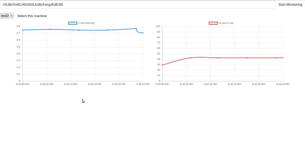

# HTTP Sysmon

Example multiple system monitor using cpp-httplib, SQlite3 and a bit of front-end JS.

   [](demo.gif)

The project is developed inside a container. To build the container, you can do
```
make build
```
To compile the project inside the container, do
```
make compile
```
Or to see all the options, do
```
make
```
